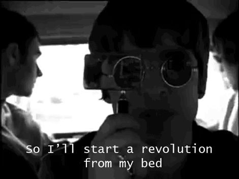
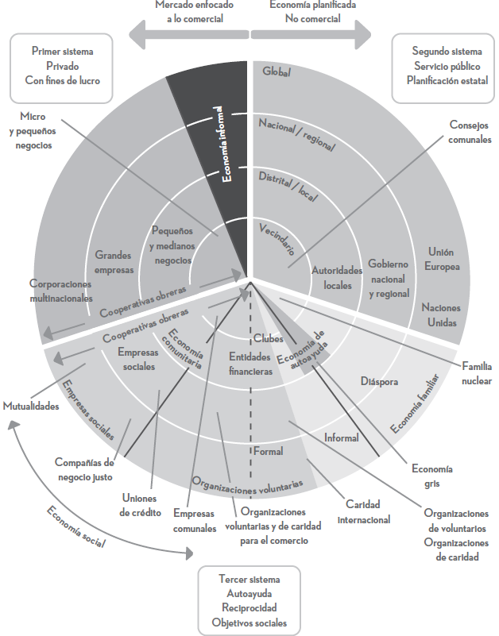

exclude: true
<style type="text/css">
code.r{
  font-size: 16px;
}
pre {
  font-size: 16px !important;
}
</style>
```{r setup, include=FALSE}
options(htmltools.dir.version = FALSE)
```

---
# __Comentarios:__ 
 .font_large[ 
* Situación difícil de las cooperativas (discusión en la unidad 5). 
* Injusticia y desigualdades; algunos problemas del sistema económico. 
* ¿Subjetividad de Sen?
* ¿Qué políticas son ejecutadas para crear una economía social? 
* ¿Quién debe promover la economía social? 
]

# __Anuncios:__
.font_large[
* Entraga del ensayo: APAs, PDF. 
* Recurden que pueden hacerme consultas en cualquier momento. 
* ¿Cómo van con los grupos para las presentaciones? 
]

---
class: middle bg-main1 
# Instituciones y cambio institucional <br> .yellow[North (2006)]
         
---
# Instituciones

.font_large[
¿Qué son las instituciones? 
] 

--

.blockquote-grey[
Son las reglas del juego en una sociedad o, más formalmente son las limitaciones ideadas por el hombre que dan forma a la interacción humana (North, 2006, p. 13)
]

.font_large[
Se dice que las instituciones estructuras incentivos. ¿Qué tipos de incentivos estaríamos hablando? 
] 

--
.font_large[
1. Económicos; 
2. Políticos;
3. Social. 
]


---
# Relación entre instituciones y economía social

.font_large[ 
¿Por qué se debería relacionar el concepto de instituciones con la economía social? 
] 

--
.font_large[
* Las instituciones definen y limitan el conjunto de elecciones de los individuos. 
* Importancia de las instituciones formales e informales. 
* Las reglas y los jugadores: 
    * Limitaciones que los humanos se imponen a sí mismos. 
]

--
## Un punto importante es que las instituciones son .red[creación humana]. Su evolución y alteración es creación humana. 


---
# Relación entre instituciones y economía social

.font_large[
* En las clases pasadas hemos hecho esfuerzo en centrarnos en lo siguiente: 
  * ¿Qué sistema económico tenemos y qué problemas tiene? 
  * ¿Cómo se puede mejorar nuestro sistema actual? 


* La relación directa con las instituciones sería: 
  * ¿Qué instituciones existen que ejercen presión para que el sistema económico sea a como es ahora? 
  * ¿Si cambiamos las instituciones se mejoraría nuestro sistema? 
  * La economía social se alimenta tanto de instituciones formales como informales. 
]

---
# Cambio institucional 

.blockquote-grey[
El cambio institucional es un proccso complicado porque los
cambios habidos al margen pueden ser consecuencia de las cambios
en cuanto a normas, limitaciones informales y diversas clases
de efectividad y observancia coercitiva. Además, generalmente las
instituciones cambian de un modo incremental, no de un modo
discontinuo (North, 2016, p. 17).
] 

<center>


---
# 

.font_large[
# Entonces, si la economía social puede ser definida como: 
]

.blockquote-grey[
Una búsqueda teórica y práctica de formas alternativas de hacer
economía, basadas en la solidaridad y en el trabajo. Su principio o
fundamento es que la introducción de niveles crecientes y cualitativamente
superiores de solidaridad en las actividades, organizaciones
e instituciones económicas, tanto a nivel de las empresas como en
los mercados y las políticas públicas (Razeto, 2006 citado en Díaz, 2015).
]

.font_large[
¿Por qué no se logra establecer fuertemente en nuestra sociedad? 

¿Qué impide que la economía social sea más promocionada? 
]

---
# Función de las instituciones

.font_large[
Para North (2006), la función principal de las instituciones es "reducir la incertidumbre establecimiendo una estructura estable [...] de la interacción humana" (p. 16). 

* ¿Por qué necesitamos que sean estables? 
* Sin embargo, que sean estables no significan que no evolucionen. 

Los cambios crean incentivos. Sin embargo puede existir divergencia entre los incentivos y el bienestar social (e.g., a nivel de comunidad).
]

---
# ¿Qué incentivos crea la economía social? 

--
.font_large[
Por un lado, podríamos retomar lo que hablabamos en la clase pasada en relación a los aspectos que condicionan la creación de nuevas formas de producción:
* Personas marginadas. 
* Sentido de cooperativismo y solidaridad. 
* Enfoque en la (re)produción, y cuido de los recursos antes de las utilidades. 
* Autonomía. 
]

---
# ¿En donde se ubica la eocnomía social? El tercer sector

<center>



---
class: middle bg-main1 

# Importancia de las .yellow[instituciones históricas]


---
# Acemoglu, Jonhson y Robinson (2001)

.font_large[
* Mejores instituciones $\longrightarrow$ Desarrollo económico  
* ¿Quién afecta a quién? 
]

.blockquote-grey[Más importante aún, las economías que son diferentes por una variedad de razones diferirán tanto en sus instituciones como en su ingreso per cápita.
]

.font_large[
* ¿Qué preguntan tratan de responder los autores? 
]

---
# Dell (2010)

.font_large[
El rol de las instituciones históricas: 
* Impacto de la historia en los resultados económicos actuales (Nunn, 2008; Glaeser &
Shleifer, 2002; Acemoglu, Johnson & Robinson, 2001; Hall & Jones, 1999;
Engerman & Sokoloff, 1997; Banerjee & Iyer, 2005).
* Por lo tanto, las instituciones pueden persistir después de que la institución misma ya no esté allí.

__Mita:__ 
* Sistema de obligaciones laborales (forzadas).
* Instituido por el gobierno español en Perú y Bolivia en 1573 y abolido en 1812.
* Las comunidades indígenas (más de 200 comunidades) se vieron obligadas a enviar a trabajar a $\frac{1}{7}$ de su población masculina adulta.
* Diferencias de los reclutas de mita en la región sometida.
]

---
# ¿Por qué las instituciones podrían .red[persistir]? 

--

.font_large[
* Cultura; 
* Incentivos y aspectos económicos; 
* Modelos alternativos que disputen el modelo presente. 

]

--
.blockquote-grey[
Las discusiones sobre los artículos académicos no van a ser necesariamente directas con la economía social (en sentido de las ideas de cooperativas etc.); sino vamos a entrar a un poco a entender factor que pueden influir en la creación de modelos o cuestiones que impulsen el desarrollo económico. 
]

---
# .red[Anuncios]

.font_large[
* Para la próxima discutiré directamente los papers correspondientes: 

Nunn & Wantchekon (2011) y Ostrom (2000). 
* Deberán tener listos ya los grupos para las presentaciones. Así ya podrán a comenzar a preguntarme sobre sus lecturas. 
* Ensayo grupal: 
  * El ensayo segurá el mismo formato que el individual. Deberán formar grupos de 3 a 4 personas. 
]