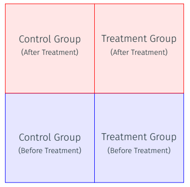
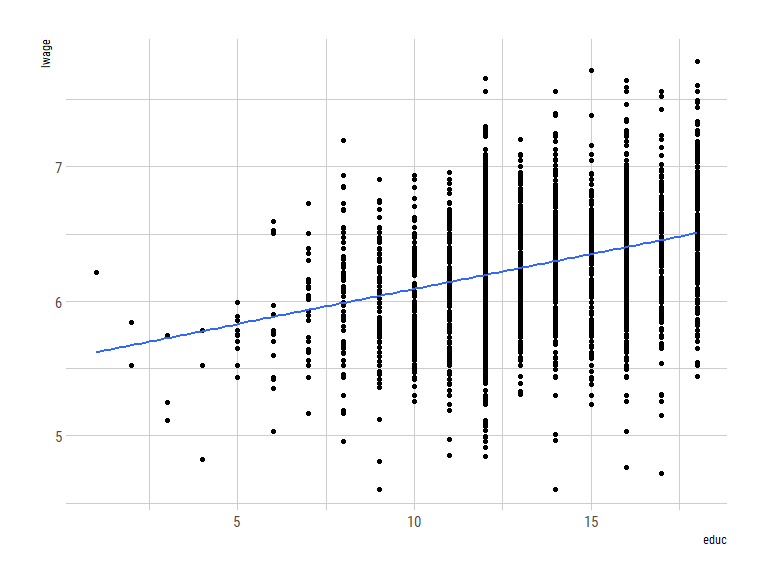

<style>
body {
text-align: justify}
</style>

Este es un pequeño taller sobre como pueden implementar métodos de evaluación de impacto para intervencioes sociales. El objetivo de este taller es que ustedes pueden adquirir conocimientos sobre cómo estimar el impacto de x o y programa social a través de **Stata** o **R**. A su vez, espero que esto se les sea de utilidad para sus tesis de grado. En general, solo se presentarán los métodos más comunes y más fáciles que pueden ocupar para sus tesis. Estos son: (1) diferencia-en-diferencia, y (2) variables instrumentales. He omitido Prueba Controlada Aleatorizada (RCT) debido a la poca probilidad de poder ejecutar a nivel de licenciatura y en Nicaragua estos experimentos. 

> **Nota:** He incluído la *traducción* de mis código de Stata a R, en caso que en un futuro ustedes quieran aprender a utilizar este programa. Lo cual les recomiendo profundamente.

¡Comenzemos!

# Diferencia-en-Diferencia

El modelo de Diferencia-en-Diferencia (DID) es uno de lo más usados actualmente para realizar evaluación de impacto. Tiene sus limitantes que, lamentablemente por motivos de tiempo, no serán abordadas en este taller. El modelo simple de DID se puede asumir en el siguiente escenario: 

* Dos periodos: 
  1. Antes
  2. Después
* Dos grupos: 
  1. Tratamiento 
  2. Control


Este tipo de modelos se ocupan cuandos la asignación del grupo tratamiento no se realizó de manera aleatoria. Por lo tanto, asumimos que existen dos tipos de diferencias: (1) dentro de los grupos, y (2) entre los grupos. 

<center>
{width=300px}
</center>

La ecuación (1) presenta un modelo sencillo DID:  

$$
y_{i,t}= \gamma + \beta D_i + \eta T_t + \delta (D_x \cdot T_t) + \xi_{i,t}, \tag{1}
$$

Donde $y_{i,t}$ es nuestro outcome de interés para individuo $i$ en tiempo $t$.

* $D \in \{0,1\}$ es una variable dummy es igual 1 si el individuo recibió el programa, y 0 de lo contrario; 
* $T \in \{0,1\}$ es otra variable dummy que es igual a 1 en el periodo post-introducción del programa y 0 en el periodo pre-introducción del programa.
* La estructura de los datos es muy importante.

Supuesto del modelo: 

* Tendencias paralelas.

La relación de los grupos y el tiempo se puede ver en la siguiente figura.

## Ejemplo de DID

En este ejemplo trabajaremos con datos a nivel de país y diferentes años. La diferencia con la ecaución (1) es que nuestros subíndice en vez de $i$ sería $c$ que significaría *país*. Para poder analizar el modelo, vamos a revisar primero nuestros datos que están en el subfolder `analisis/datos/dta`. Corremos los siguientes comandos para leer nuestra base, y la visualizamos con el comando `browse` en Stata y `View()` en R.

<div class="column-left">
\btwocol
Stata

```stata
* cargar y explorar los datos
* ~~~~~~~~~~~~~~~~~~~~~
use "./analysis/data/dta/panel101.dta", clear

browse
```
</div>
\columnbreak
<div class="column-right">
R

```r
# cargar y explorar los datos
data <- read_dta("analysis/data/dta/panel101.dta")

data %>% 
  view()
```
\etwocol
</div>

Ahora, vamos a crear nuestras variables que indiquen estado de tratamiento y post-intervención de la siguiente forma: 

<div class="column-left">
\btwocol
Stata

```stata
* generar variables, tiempo, tratamiento y did
* ~~~~~~~~~~~~~~~~~~~~~
gen tiempo = (year>=1994) & !missing(year)
gen tratamiento = (country>4) & !missing(country)
gen did = tiempo * tratamiento

```
</div>
\columnbreak
<div class="column-right">
R

```r
# generar variables, tiempo, tratamiento y did
data <- data %>%  
  mutate(tiempo = ifelse(year >= 1994, 1, 0), 
         tratamiento = ifelse(country > 4, 1, 0), 
         did = tiempo * tratamiento)
```
\etwocol
</div>


Las primeras 10 observaciones serían: 


```stata
     +------------------------------------------+
     | country   year   tiempo   tratam~o   did |
     |------------------------------------------|
  1. |       A   1990        0          0     0 |
  2. |       A   1991        0          0     0 |
  3. |       A   1992        0          0     0 |
  4. |       A   1993        0          0     0 |
  5. |       A   1994        1          0     0 |
     |------------------------------------------|
  6. |       A   1995        1          0     0 |
  7. |       A   1996        1          0     0 |
  8. |       A   1997        1          0     0 |
  9. |       A   1998        1          0     0 |
 10. |       A   1999        1          0     0 |
     +------------------------------------------+
```

Como pueden notar, tenemos una variable `tiempo` que nos inidica cuando se realizó el experimento o programa, `tratamiento`, que en el caos de país A, pertenece al grupo de control, y la variabla `did` que es la multiplicación de las dos variables anteriores. Ya con nuestra variables creadas, ahora solo nos queda corre nuestra regresión. 

<div class="column-left">
\btwocol
Stata

```stata
* regresión lineal
* ~~~~~~~~~~~~~~~~~~~~~
reg y time treated did
*reg y i.time##i.treated
```
</div>
\columnbreak
<div class="column-right">
R

```r
# regresión lineal
model.1 <- lm(y ~ tiempo + tratamiento + did, data = data) 
summary(model.1)$coefficients
```
\etwocol
</div>

Fijense en el segundo comando de la regresión que ocupa el doble símbolo numeral ## para realizar la regresión. Al utilizar ##, le estamos diciendo a Stata que nos cree automáticamente la interacción, sin necesidad de crear una nueva variable. 

Resultado de la regresión lineal:

```stata
------------------------------------------------------------------------------
           y |      Coef.   Std. Err.      t    P>|t|     [95% Conf. Interval]
-------------+----------------------------------------------------------------
      tiempo |   2.29e+09   9.53e+08     2.40   0.019     3.87e+08    4.19e+09
 tratamiento |   1.78e+09   1.13e+09     1.58   0.120    -4.75e+08    4.03e+09
         did |  -2.52e+09   1.46e+09    -1.73   0.088    -5.43e+09    3.87e+08
       _cons |   3.58e+08   7.38e+08     0.49   0.629    -1.12e+09    1.83e+09
------------------------------------------------------------------------------
```

Los resultado de la tabla de regresión los pueden exportar a excel usando el paquete `outreg2` en Stata. Si no lo tienen instalado, corran el siguiente código: `ssc install outreg2`. El siguiente ejemplo utiliza `#delimit` lo que nos permite continuar el código en la siguiente linea sin detenerlo hasta que encuentre el punto y coma `;`. 

Stata

```stata
#d ; 
	outreg2 using "./analysis/outputs/taller.xls", replace 
	bdec(3) sdec(3) alpha(0.01, 0.05, 0.10) 
	nocons; 
#d cr
```

> **Nota**: Pongan atención al nombre del archivo `taller` que tiene una extensión `xls` que pueden abrir en Excel. 

## Puntos a tomar en cuenta

Debido al tiempo de este taller, no podemos abarcar completamente algunos errores que conlleva la aplicación de este modelo. A su vez, este ejemplo sencillo no contiene otros controles que puedan afectar nuestra variable de interés, los errores estándares no están ajustado por clusteres, entre otras cosas de interés econométrico.

# Variable Instrumental

Primero, comenzaremos leyendo la base de datos de Card (1996) sobre la relación entre educación e ingresos, y realizaremos un gráfico. 

<div class="column-left">
\btwocol
Stata

```stata
* scatter plot
* ~~~~~~~~~~~~~~~~~~~~~
scatter lwage educ || lfit lwage educ
graph export "./figs/fig1.pdf", replace 
```
</div>
\columnbreak
<div class="column-right">
R

```r
ggplot(data, aes(educ, lwage)) + 
  geom_point() + 
  geom_smooth(method = "lm", se = FALSE) + 
  theme_ipsum_rc()
```
\etwocol
</div>


<center> 
{width=500px}
</center>

El gráfico parece indicar que existe una relación positiva entre años de educación e ingreso. A como hemos estudiado anteriormente esta relación no es causal. Pueden existir variab les omitidas, causalidad inversa, o errores de medición. Por lo tanto, en este ejemplo utilizaremos una variable instrumental para estimar el efecto de educación. 

En el caso de variables instrumentales, nuestro modelo tiene la siguiente especificación: 

$$
y_{i} = \alpha + \beta x_{1} + \gamma x_{2} + \varepsilon_{i} \tag{2}
$$


Donde tenemos lo siguiente: 

* $x_{1}$ es una endónena explanatoria y $x_{2}$ es una variable exógena explanatoria. 
* Por lo tanto: 
  * $cov(x_{1}, \varepsilon_{i}) \neq 0$;
  * $cov(x_{2}, \varepsilon_{i}) \neq 0$. 
* Necesitamos una variable instrumental $z$ para aislar el efecto de $x_{1}$. 

Nuestra ecuación de primera etapa sería la ecuación (3), la cual computaremos sus valores ajustados e introduciremos en la ecuacíon (2).

$$
x_{1} = \iota_{0} + \iota_{1}z_{1}+ \iota_{2}x_{2} + \epsilon_{i} \tag{3}
$$
Por lo tanto, nuestra ecuación en la segunda etapa será: 

$$
y_{i} = \alpha + \beta \hat{x}_{1} + \gamma x_{2} + \varepsilon_{i} \tag{4}
$$

> **Nota**: para una derivación en detalle pueden revisar los documentos soporte que he subido al EVA.

## Ejemplo de IV 

En el caso de IV seguiremos ocupando la base de datos de Card (1996). Esta base de datos tiene como objetivo conocer el impacto de educación en los salarios. Card (1996) ocupa proximidad a la universdidad como variable instrumental. 

La informacíon sobre las variables en esta basa de datos es la siguiente: 


```stata
1. id         person identifier
2. nearc2     =1 if near 2 yr college, 1966
3. nearc4     =1 if near 4 yr college, 1966
4. educ       years of schooling, 1976
5. age        in years
6. fatheduc   father’s schooling
7. motheduc   mother’s schooling
8. weight     NLS sampling weight, 1976
9. momdad14   =1 if live with mom, dad at 14
10. sinmom14  =1 if with single mom at 14
11. step14    =1 if with step parent at 14
12. reg661    =1 for region 1, 1966
13. reg662    =1 for region 2, 1966
14. reg663    =1 for region 3, 1966
15. reg664    =1 for region 4, 1966
16. reg665    =1 for region 5, 1966
17. reg666    =1 for region 6, 1966
18. reg667    =1 for region 7, 1966
19. reg668    =1 for region 8, 1966
20. reg669    =1 for region 9, 1966
21. south66   =1 if in south in 1966
22. black     =1 if black
23. smsa      =1 in in SMSA, 1976
24. south     =1 if in south, 1976
25. smsa66    =1 if in SMSA, 1966
26. wage      hourly wage in cents, 1976
27. enroll    =1 if enrolled in school, 1976
28. KWW       knowledge world of work score
29. IQ        IQ score
30. married   =1 if married, 1976
31. libcrd14  =1 if lib. card in home at 14
32. exper     age - educ - 6

```

> **Nota**: Las discusiones sobre si este instrumento es completamente válido la dejaremos para otro día. 

Teniendo ahora nuestro instrumento y nuestras variables de interés, tenemos que correr nuestra regresión. Para poder correr nuestro modelo en Stata necesitamos el paquete `ivregress2`. El cual pueden instalar usando el siguiente código: `ssc install ivregress2`. Y corremos nuestra regresión de la siguiente manera: 

Stata

```stata
ivregress2 2sls lwage (educ = nearc2 nearc4) exper expersq black south smsa reg* smsa66, first 
```

En este código podemos observar tres cosas: 

1. `2sls`, que se refiere a que estamos estimando nuestra ecucación por mínimos cuadrados ordinarios en dos etapas.
2. `(educ = near2 nearc4)`, la cual es equivalente a nuestra primera etapa.
3. `first`, la opcíon final que nos permite recuperar la información sobre los resultados de la primera etapa. 

Resultado de la regresión lineal:

```stata
                                                Number of obs     =      3,010
                                                F(  16,   2993)   =     170.99
                                                Prob > F          =     0.0000
                                                R-squared         =     0.4776
                                                Adj R-squared     =     0.4748
                                                Root MSE          =     1.9400

------------------------------------------------------------------------------
        educ |      Coef.   Std. Err.      t    P>|t|     [95% Conf. Interval]
-------------+----------------------------------------------------------------
       exper |  -.4122915   .0336914   -12.24   0.000    -.4783521   -.3462309
     expersq |   .0008479     .00165     0.51   0.607    -.0023874    .0040832
       black |  -.9451729   .0939073   -10.06   0.000    -1.129302   -.7610434
       south |  -.0419115   .1355316    -0.31   0.757    -.3076561    .2238331
        smsa |   .4013708   .1047858     3.83   0.000     .1959113    .6068303
      reg661 |   .3334436   .2377938     1.40   0.161    -.1328123    .7996995
      reg662 |   .2331955   .1928656     1.21   0.227     -.144967     .611358
      reg663 |    .312015   .1865419     1.67   0.095    -.0537483    .6777783
      reg664 |   .4645114   .2197133     2.11   0.035     .0337071    .8953158
      reg665 |   .0650878   .1410528     0.46   0.645    -.2114825    .3416581
      reg667 |   .1246948   .1609033     0.77   0.438    -.1907974     .440187
      reg668 |   .8842307   .2742513     3.22   0.001     .3464905    1.421971
      reg669 |   .5022265   .2096933     2.40   0.017     .0910688    .9133841
      smsa66 |   .0000782   .1069445     0.00   0.999    -.2096139    .2097704
      nearc2 |   .1229986   .0774256     1.59   0.112    -.0288142    .2748114
      nearc4 |   .3205819   .0878425     3.65   0.000      .148344    .4928197
       _cons |   16.27083   .2395495    67.92   0.000     15.80113    16.74053
------------------------------------------------------------------------------

Instrumental variables (2SLS) regression               Number of obs =    3010
                                                       Wald chi2(15) =  709.89
                                                       Prob > chi2   =  0.0000
                                                       R-squared     =  0.1702
                                                       Root MSE      =   .4042

------------------------------------------------------------------------------
       lwage |      Coef.   Std. Err.      z    P>|z|     [95% Conf. Interval]
-------------+----------------------------------------------------------------
        educ |   .1570594   .0524383     3.00   0.003     .0542822    .2598366
       exper |   .1188149   .0227454     5.22   0.000     .0742348     .163395
     expersq |  -.0023565   .0003466    -6.80   0.000    -.0030358   -.0016772
       black |  -.1232778   .0520112    -2.37   0.018     -.225218   -.0213376
       south |  -.1431945   .0283691    -5.05   0.000    -.1987968   -.0875921
        smsa |    .100753   .0314355     3.21   0.001     .0391406    .1623654
      reg661 |  -.1729728   .0532743    -3.25   0.001    -.2773884   -.0685572
      reg662 |  -.0702255   .0431383    -1.63   0.104     -.154775    .0143241
      reg663 |  -.0230412   .0421217    -0.55   0.584    -.1055982    .0595158
      reg664 |  -.1254052   .0519118    -2.42   0.016    -.2271504     -.02366
      reg665 |  -.0184927   .0291779    -0.63   0.526    -.0756804     .038695
      reg667 |  -.0309372   .0335537    -0.92   0.357    -.0967013    .0348268
      reg668 |  -.2680339   .0724676    -3.70   0.000    -.4100678       -.126
      reg669 |  -.0699968   .0531631    -1.32   0.188    -.1741945    .0342009
      smsa66 |   .0150626   .0222765     0.68   0.499    -.0285986    .0587238
       _cons |   3.409684   .8619147     3.96   0.000     1.720362    5.099005
------------------------------------------------------------------------------
Instrumented:  educ
Instruments:   exper expersq black south smsa reg661 reg662 reg663 reg664
               reg665 reg667 reg668 reg669 smsa66 nearc2 nearc4

```


Y para exportar nuestra tabla a excel podemos ocupar a como hicimos anteriormente `outreg2`: 

Stata

```stata
#d 
est restore first; 
	outreg2 using ".\analysis\outputs\taller_iv.xls", replace cttop(first)				
			bdec(3) sdec(3) alpha(0.01, 0.05, 0.10) 											
			nocons label;			
est restore second;
	outreg2 using ".\analysis\outputs\taller_iv.xls", cttop(second)			
			bdec(3) sdec(3) alpha(0.01, 0.05, 0.10) 											
			nocons label;			
#d cr
```

## Puntos a tomar en cuenta

Al igaul que en el caso del modelo DID, no hemos abarcado completamente errores que pueden surgir al implementar el método de variables instrumentales. De igual forma, no hemos ajustado nuestros errores estándares y considerado otros aspectos econométricos relevantes.

# Instrucciones para la tarea

En el aulo virtual he subido un archivo comprimido que contiene los siguientes documentos:

1. PDF con las indicaciones del taller número 2. 
2. Base de datos a analizar 
3. Do-file que ustedes tendrán que completar. 

Por favor leánlo bien, y si tienen alguna duda ya saben que pueden comunicarse conmigo a través de correo o por el EVA.


