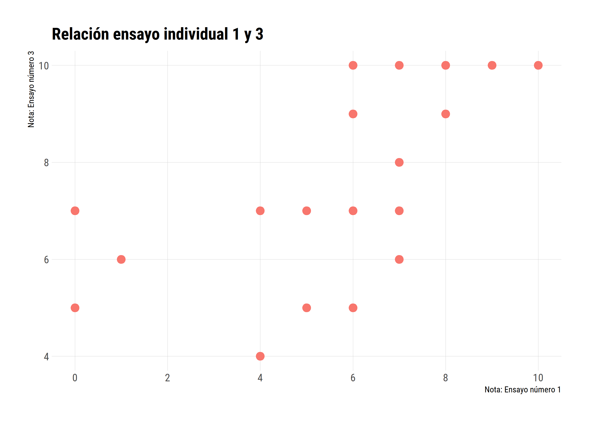

exclude: true
<style type="text/css">
code.r{
  font-size: 16px;
}
pre {
  font-size: 16px !important;
}
</style>

---
# Comentarios 

Resultados del ensayo: 
* Media: 7.8 
* Relación con el primer ensayo. 

Resultados del taller: 
* Media: 19
* ¿Bastante fácil no? 

Ya con esto, llevamos 55 puntos acumulados. 
* Quedan pendiente la presentación y el taller númeor 2.
* Noticias sobre el segundo taller al final de la clase.

---
# Comentarios



---
# Presentaciones grupales

* Primero, vamos a seleccionar a los grupos que van a exponer hoy: 

.details[
```{r sample}
sample(1:5, 5, replace = FALSE)
```
] 

--
* Tendrán solamente 20 minutos, no habrá más tiempo. 
* Claramente pueden terminar antes. 
